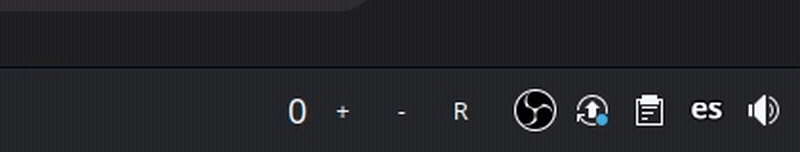

# KDE Plasma Widget: Distraction Counter ⏳

A KDE Plasma widget inspired by [This $2 Gadget Doubled My Productivity - YouTube](https://www.youtube.com/watch?v=q4aQ6BjH174). The widget helps track distractions and trains your focus by logging and redirecting wandering thoughts.

## Purpose

The Distraction Counter is designed to:

- Help you stay mindful of distractions while working.
- Log distractions with a single click.
- Encourage productivity by setting focus goals.

## Demo



## Installation

1. Clone this repository:

   ```bash
   git clone https://github.com/mateogon/distraction-counter.git
   cd distraction-counter
   ```

2. Install the widget:

   ```bash
   plasmapkg2 --install .
   ```

3. Add the widget to your desktop or panel:
   - Right-click on the desktop or panel.
   - Select **"Add Widgets"** and search for **Distraction Counter**.

## Usage

- **+ Button**: Log a distraction.
- **- Button**: Remove a logged distraction.
- **R Button**: Reset the counter.

Track distractions throughout your day and challenge yourself to redirect focus more effectively.
